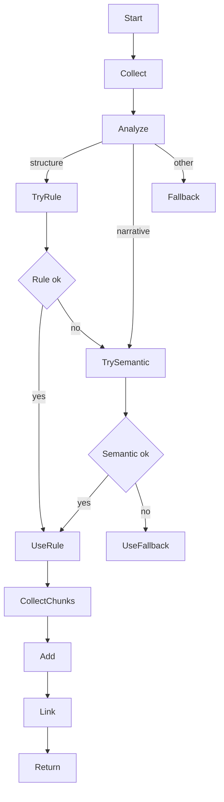

# Module `chunkers` — Chunking (phân đoạn) văn bản cho RAG

Mục tiêu: thư mục `chunkers/` chứa các chiến lược phân đoạn (chunking) văn bản đầu vào (từ `loaders`) thành các đoạn (chunks) sẵn sàng để embedding, lưu trữ và truy vấn. Thiết kế theo nguyên tắc Single Responsibility và dễ mở rộng — mỗi chunker là một strategy độc lập (semantic, rule-based, fixed-size, block-aware) và `HybridChunker` là orchestrator.

README này mô tả chi tiết cấu trúc mã, API công khai, luồng xử lý, các kiểu dữ liệu (Chunk, ChunkSet, BlockSpan, Provenance), cách chọn strategy, và ví dụ sử dụng.

## Nội dung thư mục (tóm tắt)

- `base_chunker.py` — abstract base class `BaseChunker` (interface): `chunk(document) -> ChunkSet`, `chunk_blocks(blocks, doc_id) -> List[Chunk]`, `estimate_tokens`, `validate_config`.
- `hybrid_chunker.py` — `HybridChunker` orchestration, hỗ trợ các mode: AUTO, SEMANTIC_FIRST, STRUCTURAL_FIRST, FIXED_SIZE, SEQUENTIAL.
- `semantic_chunker.py` — `SemanticChunker` (spaCy optional): chia theo ranh giới câu và coherence (discourse markers, lexical/entity overlap).
- `rule_based_chunker.py` — `RuleBasedChunker`: dựa trên cấu trúc tài liệu (headings, lists, tables, code blocks) và regex/NLP hints.
- `fixed_size_chunker.py` — `FixedSizeChunker`: chunk theo số token cố định (dùng tiktoken khi có, fallback char-based). Có TokenizerAdapter, score computation, token boundary heuristics.
- `block_aware_chunker.py` — `BlockAwareChunker`: chunking tận dụng block đã merge từ `PDFLoader`, giữ source tracking chi tiết (file/page/block indices, bbox).
- `model/` — các mô hình dữ liệu liên quan:
  - `chunk.py`, `chunk_set.py`, `chunk_stats.py`, `block_span.py`, `enums.py`, `provenance_agg.py`, `score.py` — biểu diễn `Chunk`, `ChunkSet`, provenance, scoring.

## Contract (inputs/outputs)

- Input chính: `loaders.model.document.PDFDocument` (đã normalize) hoặc list `Block` objects (được loader tạo ra).
- Output chính: `chunkers.model.ChunkSet` (tập hợp `Chunk`), mỗi `Chunk` có:
  - `chunk_id`, `text`, `token_count`, `char_count`, `chunk_type`, `strategy`, `provenance`, `score`, `metadata`.

Error modes: chunker có thể ném lỗi khi config không hợp lệ; nhiều phần có fallback (ví dụ hybrid -> fixed_size nếu semantic/structural thất bại). Các lỗi runtime thường được catch và log để pipeline tiếp tục.

## Kiến trúc chi tiết — component-by-component

### `BaseChunker`

- Interface chung cho mọi chunker: giữ cấu hình `max_tokens` và `overlap_tokens`.
- Hàm quan trọng:
  - `chunk(document: PDFDocument) -> ChunkSet` — chunk toàn tài liệu.
  - `chunk_blocks(blocks: List[Block], doc_id: str) -> List[Chunk]` — chunk list block.
  - `estimate_tokens(text: str) -> int` — ước lượng token (mặc định 4 ký tự = 1 token).

### `FixedSizeChunker`

- Ý tưởng: chia liên tục theo giới hạn token cố định, với overlap token.
- TokenizerAdapter dùng `tiktoken` nếu có, fallback char-based nếu không.
- Tùy chọn: `respect_sentence_boundary` để điều chỉnh điểm cắt gần ranh giới câu.
- Trả về `ChunkSet` với `ChunkType.FIXED_SIZE` và metadata tokenizer.

Edge cases:

- Tokenizer không khả dụng -> fallback char-based.
- Boundary adjustment có thể làm giảm độ chặt token; implement `_find_boundary` heuristics.

### `SemanticChunker`

- Chia theo câu có ý nghĩa: sử dụng spaCy nếu được cung cấp (khuyến khích inject `nlp`), grouping sentences theo coherence.
- Coherence scoring: discourse markers, lexical overlap, optional entity overlap (spaCy).
- Chiến lược phù hợp cho text liền mạch, narrative.

Đặc điểm:

- Không thêm overlap nhân tạo (semantic grouping giữ context tự nhiên).
- Thích hợp cho văn bản luận án, bài báo, đoạn miêu tả dài.

### `RuleBasedChunker`

- Dựa trên cấu trúc tài liệu: phát hiện headings, lists, tables, code blocks bằng regex và (tùy chọn) spaCy.
- Nhóm block theo type; sau đó build chunk cho mỗi nhóm (header-based, list-based, table-based, paragraph-based).
- Với bảng (`table`), builder sẽ tạo `metadata['embedding_text']` (pipe-separated) và cố gắng tôn trọng giới hạn token (cắt hàng nếu cần) đồng thời lưu provenance cấp cell.

Lợi thế:

- Rất phù hợp cho tài liệu có cấu trúc rõ (whitepapers, báo cáo, tài liệu kỹ thuật).

### `BlockAwareChunker`

- Thiết kế để dùng trực tiếp với blocks đã merge từ `PDFLoader`.
- Giữ `ChunkSource` với `file_path`, `page_number`, `block_indices`, `bbox`, `chunk_id`, `created_at`.
- Chunk boundaries tôn trọng ranh giới block; source tracking chi tiết để hỗ trợ citation.

Use-cases:

- Tạo chunks hướng citation (UI hiển thị page/blocks provenance).

### `HybridChunker`

- Orchestrator chính: khởi tạo các sub-chunkers (semantic, rule-based, fixed-size) và chọn chiến lược theo `mode`:
  - AUTO: phân tích đặc tính tài liệu và chọn structural/semantic/fallback fixed.
  - SEMANTIC_FIRST, STRUCTURAL_FIRST, FIXED_SIZE, SEQUENTIAL.
- Phân tích đặc tính: `_has_clear_structure`, `_is_narrative_text`, trung bình block token size.
- Tích hợp kết quả: thu tất cả chunks, thêm vào `ChunkSet`, gọi `link_chunks()` để nối previous/next.

## Models (ngắn gọn)

- `Chunk` — core data model (text, token_count, provenance, score, metadata, previous/next id)
- `ChunkSet` — collection cho một document; có `add_chunk`, `link_chunks`, `get_stats`.
- `BlockSpan` — offsets trong block source (block_id, start_char, end_char, page_number).
- `ProvenanceAgg` (ở `model/provenance_agg.py`) — tập spans, convenient `to_dict()` cho UI.

## Luồng xử lý (high-level) khi chunking một `PDFDocument`

1. `HybridChunker.chunk(document)` được gọi (hoặc `Loader`/pipeline gọi trực tiếp chunker cụ thể).
2. Thu thập tất cả `Block` hợp lệ từ `document.pages`.
3. Dựa trên `mode` hoặc analysis, chọn strategy (structural/semantic/fixed).
4. Gọi `chunk_blocks(blocks, doc_id)` của strategy đã chọn.
5. Strategy tạo `Chunk` objects có `provenance` (BlockSpan) và `metadata` phù hợp (ví dụ table embedding_text).
6. `HybridChunker` thêm chunks vào `ChunkSet`, gọi `link_chunks()`, trả `ChunkSet` cho pipeline.

## Ví dụ sử dụng (Python)

```python
from chunkers.hybrid_chunker import HybridChunker, ChunkerMode
from loaders.pdf_loader import PDFLoader

# Load document
loader = PDFLoader.create_default()
doc = loader.load(r"data/pdf/my_doc.pdf")

# Chunk bằng hybrid (auto)
chunker = HybridChunker(max_tokens=512, overlap_tokens=50, mode=ChunkerMode.AUTO)
chunk_set = chunker.chunk(doc)

print(f"Chunks: {len(chunk_set.chunks)}")
for c in chunk_set.chunks[:5]:
    print(c.chunk_id, c.token_count, c.metadata.get('group_type'))
```

PowerShell quick-run (pipeline):

```powershell
python run_pipeline.py
```

## Cấu hình & tuning

- `max_tokens` và `overlap_tokens` là tham số quan trọng. Thử nghiệm với max_tokens=512, overlap=50 thường phù hợp cho nhiều LLM.
- `HybridChunker` config:
  - `mode`: AUTO / SEMANTIC_FIRST / STRUCTURAL_FIRST / FIXED_SIZE / SEQUENTIAL
  - `min_sentences_per_chunk` (semantic)
- `RuleBasedChunker`: có thể bật spaCy (`use_spacy=True`) để cải thiện detection heading/list.
- `FixedSizeChunker`: cung cấp `encoding_name` cho TokenizerAdapter (mặc định `cl100k_base`).

## Edge cases & notes

- Bảng lớn: `RuleBasedChunker` cố gắng tạo `embedding_text` bằng rows + header và sẽ truncate theo budget; provenance cell-level được ghi nếu có.
- Nhiều nhỏ blocks ngắn (headers/footers): `Block` filtering nên được xử lý ở `loaders` (đã có block_hash_counter). Chunker giả định loader đã lọc header/footer.
- Tokenizers/encoders: `tiktoken` là tùy chọn; nếu không có, chunkers dùng estimate 4 chars/token (ước tính thô).

## Kiểm thử

- Repository có pytest; viết test cho mỗi chunker:
  - happy path với vài blocks mẫu -> xác nhận số chunks và provenance
  - test fallback khi tiktoken/spaCy không có
  - test table chunking và metadata embedding_text/truncation

Ví dụ test (pseudo):

```python
def test_fixed_size_chunker_simple():
    from chunkers.fixed_size_chunker import FixedSizeChunker
    from chunkers.model.chunk import Chunk
    # tạo blocks giả lập
    # gọi chunk_blocks -> assert chunks non-empty và token_count <= max_tokens

```

## Contribution

- Thêm strategy mới: implement `BaseChunker` và export trong `chunkers/__init__.py`.
- Viết unit tests cho mọi logic mới (grouping, table truncation, provenance mapping).
- Nếu thêm dependency lớn (spaCy models, camelot), update `requirements.txt` và README runtime dependencies.

## Tài liệu tham chiếu

- `chunkers/hybrid_chunker.py` — điểm bắt đầu (orchestrator)
- `chunkers/semantic_chunker.py`, `chunkers/rule_based_chunker.py`, `chunkers/fixed_size_chunker.py`, `chunkers/block_aware_chunker.py` — implementations
- `chunkers/model/` — data models (Chunk, ChunkSet, Provenance, BlockSpan)

## Sơ đồ quyết định — HybridChunker (Mermaid + ASCII fallback)

Dưới đây là sơ đồ Mermaid mô tả logic quyết định trong `HybridChunker` khi ở chế độ `AUTO`. Phiên bản này dùng tên node ngắn gọn và tránh style/ngôn từ có thể gây lỗi cho bộ dò của GitHub.



ASCII fallback (same flow):

1. HybridChunker nhận `document` và thu thập tất cả `Block` hợp lệ.
2. Phân tích đặc tính tài liệu:
   - has_structure: >30% blocks có indicator (heading/list/table)
   - is_narrative: avg block length lớn + discourse markers
   - avg_block_tokens: trung bình tokens/block
3. Decision:
   - Nếu has_structure và avg_block_tokens < max_tokens: thử `RuleBasedChunker` (structural-first).
     - Nếu structural thành công (chunks chất lượng), dùng kết quả.
     - Nếu structural thất bại, fallback sang `SemanticChunker`.
   - Nếu không có structure rõ nhưng là narrative: thử `SemanticChunker`.
     - Nếu semantic thành công, dùng kết quả.
     - Nếu semantic thất bại, fallback sang `FixedSizeChunker`.
   - Nếu không thuộc hai trường hợp trên: trực tiếp dùng `FixedSizeChunker`.
4. Sau khi có chunks: `HybridChunker` thêm tất cả `Chunk` vào `ChunkSet`, gọi `link_chunks()` và trả `ChunkSet` cho pipeline.
5. Ghi chú: mọi bước đều có fallback để đảm bảo không mất dữ liệu; nếu sub-chunker ném lỗi, Hybrid catch lỗi và chuyển sang fallback tiếp theo.
