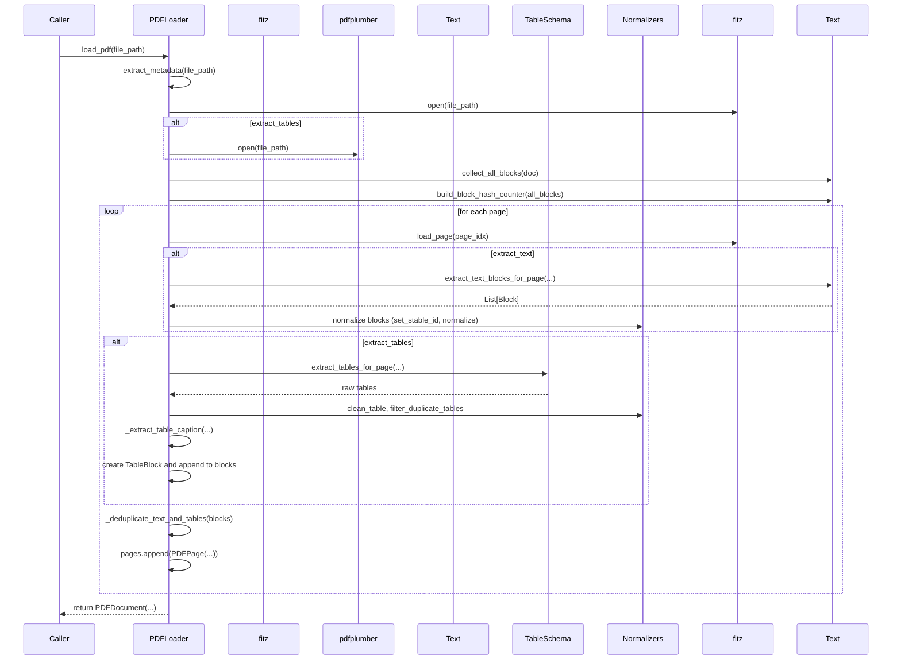

# Module loaders — Tải và tiền xử lý PDF

Phiên bản: chi tiết module loader cho hệ thống RAG (Retrieval-Augmented Generation).

Mô tả ngắn: thư mục `loaders/` chứa các lớp và hàm chịu trách nhiệm đọc PDF thô, trích xuất văn bản và bảng, biểu diễn tài liệu dưới dạng mô hình nội bộ (pages, blocks, tables, text), và chuẩn hoá / xử lý hậu xử lý (normalizers). Module này không thực hiện chunking, embedding hay lưu trữ vector — nó chỉ chuẩn bị dữ liệu thô cho các bước sau trong pipeline.

## Mục tiêu và phạm vi

- Tách trách nhiệm: chỉ xử lý I/O và chuẩn hoá nội dung PDF.
- Cung cấp API rõ ràng để các thành phần khác (chunker, embedder, pipeline) có thể tái sử dụng.
- Hỗ trợ trích xuất bảng, phát hiện block, và cơ chế normalizer có thể mở rộng.

## Kiến trúc tổng quan

Thư mục `loaders/` gồm các phần chính:

- `pdf_loader.py` — Lớp/factory để load file PDF, chọn engine (fitz/PyMuPDF, pdfplumber, camelot) và trả về một `Document` trong `model/`.
- `config.py` — Các cấu hình mặc định cho loader (ex: extract_tables, min_text_length, engine priority).
- `ids.py` — Hỗ trợ sinh id/provenance cho block, page, document.
- `model/` — Kiểu dữ liệu biểu diễn tài liệu đã trích xuất:
  - `document.py` — đối tượng tài liệu (Document) tổng hợp các page/blocks.
  - `page.py` — thông tin từng trang (số trang, vùng chứa blocks).
  - `block.py` / `text.py` / `table.py` — block nội dung, phân biệt table/text, metadata (bounding boxes, nguồn, confidence).
  - `base.py` — base class cho model.
- `normalizers/` — tập hợp module xử lý hậu kỳ: loại bỏ trùng lặp, hợp nhất block, xử lý dấu chấm, phân tích table, util cho spaCy.

Luồng dữ liệu điển hình:

```text
PDF (data/pdf/*.pdf)
  -> PDFLoader (extraction: text + tables)
  -> model.Document (pages, blocks, tables)
  -> normalizers (clean, dedupe, table post-process)
  -> Đầu ra cho chunkers.HybridChunker
```

## Các module chính (chi tiết)

### pdf_loader.py

- Mục đích: nhận đường dẫn file hoặc luồng bytes, chạy trình trích xuất, trả về `Document` đã thô.
- Tính năng thường thấy (factory + constructor injection):
  - `PDFLoader.create_default()` — factory sử dụng cấu hình mặc định (text + table extraction, normalization off/on theo config).
  - `PDFLoader.load(path_or_bytes)` — trả về `Document`.
  - Tùy chọn engine: `fitz` (PyMuPDF) là chính, `pdfplumber` và `camelot` dùng cho table fallback.

Ghi chú: tên hàm factory hoặc chi tiết API có thể khác nếu mã nguồn thay đổi; README này mô tả theo conventions của dự án.

### normalizers/

Các script có trong thư mục và mục đích:

- `analyze_duplicates.py` — phân tích và báo cáo các đoạn trùng lặp giữa blocks (dùng cho profiling & debug).
- `check_block_duplicates.py` — kiểm tra và loại bỏ block trùng.
- `check_dots.py` — logic xử lý các dòng chấm/điểm (ví dụ: "...." hoặc dấu chấm lặp trong header/footer).
- `review_lost_blocks.py` — công cụ dò tìm block có thể bị mất trong extraction (giúp tinh chỉnh engine).
- `spacy_utils.py` — tiện ích để tích hợp spaCy (tokenization, sentence boundary detection) cho chunking/semantic normalization.
- `table_utils.py` — xử lý bảng: ghép header/rows, chuẩn hoá schema, xuất sang markdown/csv cho debug.
- `text_utils.py` — chuẩn hoá text (newline normalization, whitespace trimming, unicode fixes).

Những normalizer này có thể được gọi theo chuỗi (pipeline) trên `Document` trước khi chuyển cho `chunkers`.

## Hành vi "Auto-quét" (Auto-scan) và tích hợp với pipeline

Thư mục `loaders/` được thiết kế để chạy cả dưới dạng thư viện (gọi trực tiếp từ code) và trong một pipeline tự động.

- Auto-quét (ở cấp pipeline): file `run_pipeline.py` hoặc `pipeline/rag_pipeline.py` thường quét `data/pdf/` để tìm PDF mới, gọi `PDFLoader` cho từng file, và lưu kết quả (chunks/metadata/embeddings) vào `data/` phù hợp.
- Cơ chế cache: pipeline duy trì cache chunk đã xử lý trong `data/cache/processed_chunks.json`. Nếu nội dung chunk không đổi (dựa trên hash), loader/pipeline sẽ bỏ qua re-processing.
- Để ép làm lại (force re-process), xóa file cache như hướng dẫn trong repository root (xem RAG_QUICKSTART.md và copilot-instructions). Việc này sẽ buộc loader + chunker re-chạy trên file PDF.

Ví dụ run nhanh (PowerShell):

```powershell
# Chạy pipeline xử lý tất cả PDF trong data/pdf
python run_pipeline.py
```

Hoặc chỉ dùng loader trong script Python:

```python
from loaders.pdf_loader import PDFLoader

# Tạo loader mặc định (factory)
loader = PDFLoader.create_default()

# Load một file PDF -> trả về Document
doc = loader.load(r"data/pdf/my_doc.pdf")

print(doc.metadata)
for page in doc.pages:
    for block in page.blocks:
        print(block.block_type, block.text[:120])
```

## Contract (tóm tắt API / dữ liệu)

- Input: đường dẫn file PDF (str) hoặc bytes.
- Output: `Document` object với các thuộc tính chính:
  - `metadata` (title, author, source_path, load_time)
  - `pages` (list of Page)
  - `page.blocks` (Block objects: text/table, bounding box, page_number, provenance id)
- Error modes: file not found, encrypted PDF (password required), unsupported encoding, extraction engine error.

## Edge cases và cách xử lý

- File rỗng / scanned image: loader có thể trả nội dung rỗng; để xử lý OCR cần bổ sung module OCR (tesseract hoặc engine trả về image->text).
- PDF bị mã hoá: hiện tại loader sẽ raise exception hoặc trả `Document` với metadata báo lỗi; pipeline nên bắt exception và log vào `data/metadata`.
- Bảng phức tạp: `camelot` hoặc `pdfplumber` có thể xử lý nhiều trường hợp, nhưng không đảm bảo 100% chính xác — dùng `table_utils` để review.
- Encoding/Unicode: `text_utils` cố gắng chuẩn hoá; nếu gặp lỗi encoding, mở file bằng chế độ binary và thử fallback decode.

## Logging & Debugging

- Loader ghi log ở mức thông tin/ lỗi; tích hợp với logging config của toàn dự án (xem `config/app.yaml`).
- Để debug extraction cụ thể, bật chế độ verbose khi gọi `PDFLoader` (nếu API hỗ trợ) hoặc gọi script trong `normalizers/` để phân tích các blocks trên file sample.

## Kiểm thử

- Repository có cấu hình pytest (xem `pyproject.toml`). Để chạy test liên quan tới loaders:

```powershell
python -m pytest test/loaders -v
```

- Nếu không có test sẵn cho loader, bạn có thể viết test unit cho:
  - `PDFLoader.load` với sample PDF (happy path).
  - Normalizer functions: dedupe, check_dots, table_utils.

## Hướng dẫn đóng góp (contributors)

- Viết comment và docstring bằng tiếng Việt theo convention của repo.
- Tuân theo pattern: factory methods, constructor injection (không dùng global config trực tiếp trong class). Sử dụng `config_loader.get_config()` nếu cần config chung.
- Thêm unit test cho mọi thay đổi logic extraction/normalization.
- Nếu thêm dependency (ví dụ: `camelot` hoặc `tika`), update `requirements.txt` và thông báo trong PR.

## Tài liệu tham chiếu và liên kết

- Pipeline orchestration: `pipeline/rag_pipeline.py` — tích hợp loader vào flow xử lý đầy đủ.
- Chunkers: thư mục `chunkers/` — loader tạo input cho chunkers.
- Normalizers: `loaders/normalizers/` — xem từng file để biết logic cụ thể.
- Cấu hình toàn cục: `config/app.yaml` và `loaders/config.py`.

## Ghi chú triển khai / Assumptions

- README này mô tả API theo conventions được sử dụng trong repository (factory `PDFLoader.create_default()` và hành vi cache). Nếu tên hàm hoặc chi tiết triển khai khác, kiểm tra `loaders/pdf_loader.py` để đồng bộ ví dụ.
- OCR không được bật mặc định; nếu cần OCR, bổ sung module OCR và cập nhật pipeline.

---

Nếu bạn muốn, tôi có thể: đọc nhanh `pdf_loader.py` và `model/document.py` để đồng bộ kỹ thuật các tên hàm trong ví dụ; hoặc tạo thêm một test nhỏ `test/loaders/test_pdf_loader.py` để tự động kiểm tra một sample PDF (nếu bạn cung cấp sample PDF hoặc cho phép tạo mock).

## Chi tiết kỹ thuật theo file (tham chiếu mã nguồn)

Dưới đây là mô tả chi tiết, chính xác theo các lớp/hàm hiện có trong thư mục `loaders/` và `loaders/model` / `loaders/normalizers` — đọc từ mã nguồn để đảm bảo ví dụ và tên API khớp.

### `loaders/pdf_loader.py` — lớp PDFLoader

- Lớp chính: `PDFLoader`.
- Constructor (tham số chính):
  - `extract_text: bool` (mặc định True)
  - `extract_tables: bool` (mặc định True)
  - `tables_engine: str` ('auto' | 'camelot' | 'pdfplumber')
  - `min_repeated_text_threshold: int`
  - `min_text_length: int`
  - `repeated_block_threshold: int`
  - `enable_repeated_block_filter`, `enable_position_filter`, `enable_page_number_filter`, `enable_empty_filter`, `enable_bbox_filter` (flags)
  - `min_bbox_area: float`
  - `enable_block_merging: bool`, `min_block_length: int`
  - `enable_block_normalization: bool`, `enable_sentence_segmentation: bool`
  - `enable_block_normalization: bool`, `enable_sentence_segmentation: bool`

ASCII fallback (flow):

```text
PDFLoader -> PDFDocument (pages, blocks, tables)
Analyze document: has_structure? has_tables? is_narrative? avg_block_tokens

Decision:
  - If tables present and `table_prefer_chunks` enabled: create chunks from TableBlock preserving cell provenance.
  - Else if clear structure: use RuleBasedChunker.
  - Else if narrative: use SemanticChunker.
  - Else: fallback to FixedSizeChunker.

After sub-chunker returns chunks:
  - Add chunks to ChunkSet with provenance metadata and page ranges.
  - Call `ChunkSet.link_chunks()` to set prev/next and indexes.
  - Apply `post_chunk` hooks (re-rank, dedupe, merge small neighbors) if configured.

Provenance notes:
  - Table chunks SHOULD include per-cell provenance; if truncated, include `truncated` flag and original `TableSchema.id` + row/col ranges.
  - Loaders expose stable ids (e.g. `block_stable_id`, `table_stable_id`) that should be copied into `Chunk.metadata`.

```

Hook points (where to extend):

- `pre_analyze(document)`: add tags or custom filters before analysis (e.g. detect language, force OCR flag).
- `pre_chunk(chunk_input)`: transform blocks/tables before sub-chunker (e.g. collapse footnotes, inline small tables).
- `post_chunk(chunk_set)`: re-ranking, dedupe, or serialize provenance for downstream UI.

Testing hints:

- Create a fixture `sample_document_with_tables` (PDFDocument mock) with a small `TableSchema` and assert table-provenance is preserved in resulting chunks.
- Test fallback paths by creating documents where `RuleBasedChunker` fails and assert `HybridChunker` falls back to `SemanticChunker` or `FixedSizeChunker`.

- `Block` dataclass (fields): `text: str`, `bbox`, `text_source`, `stable_id`, `content_sha256`, `metadata: dict`.
- `Block.normalize(config=None)` — fix unicode (ftfy), de-hyphenation, remove TOC dots, normalize whitespace (dùng `normalizers.block_utils.normalize_whitespace`), round bbox, compute `stable_id` và `content_sha256` nếu metadata có `doc_id` và `page_number`.
- `TableBlock(Block)` mở rộng cho bảng, có `table: TableSchema` và override `normalize` để normalize table.

### `loaders/model/text.py` — helper text extraction

- Lớp `Text` (không phải instance): static methods:
  - `extract_text_blocks_for_page(doc, page_idx, all_blocks, block_hash_counter, config)` — nhận raw blocks (tuples) cho page và build list `Block` objects, áp dụng merging (dùng `normalizers.text_utils.merge_blocks_list`), áp dụng filter logic (dùng `Text.should_filter_block`). Trả về List[Block].
  - `should_filter_block(...)` — wrapper sniff rules (calls `normalizers.text_utils` helpers) để quyết định loại block.
  - `collect_all_blocks(doc)` và `build_block_hash_counter(all_blocks)` — tiện ích dùng để tính counter hash across doc.

### `loaders/model/table.py` — `TableSchema`, `TableRow`, `TableCell`

- `TableSchema` là container nhẹ cho bảng: `id`, `file_path`, `page_number`, `header: List[str]`, `rows: List[TableRow]`, `bbox`, `markdown`, `metadata`, `stable_id`, `content_sha256`.
- Methods:
  - `from_matrix(matrix, file_path, page_number, bbox, markdown, metadata) -> TableSchema` — build từ matrix rows.
  - `to_markdown()`, `to_matrix()` — xuất bảng.
  - `extract_tables_pdfplumber(plumber_pdf, page_num)` và `extract_tables_camelot(file_path, page_num, camelot_module)` — backend extraction.
  - `extract_tables_for_page(file_path, page_num_1based, plumber_pdf, tables_engine, camelot_module)` — engine selector (auto -> pdfplumber then camelot fallback).
  - `merge_split_tables(tables)` — ghép các bảng chia trang.
  - Các helpers: `normalize` (header/rows), `normalize_table_cells`, `_drop_empty_columns`, `header_looks_like_continuation`, `make_row`, `reindex_rows`, `match_row_to_columns`.

### `loaders/model/base.py` — `LoaderBaseModel`

- Base class cung cấp `to_dict()`, `from_dict()`, `validate()` và interface `normalize()` để các model kế thừa.

### `loaders/normalizers/block_utils.py` — các utilities lọc và merge

- Các hàm chính:
  - `compute_block_hash(text)` — md5 trên normalized text (lower, collapse whitespace).
  - `is_repeated_block(text, block_hash_counter, threshold)` — check nếu xuất hiện >= threshold.
  - `is_header_footer_block(text, bbox, page_height)` — position-based header/footer detection.
  - `is_page_number_block(text)` — pattern matching page numbers.
  - `is_empty_or_whitespace_block(text, min_length)` — check empty/short.
  - `is_bbox_too_small(bbox, min_area, min_width, min_height)` — bbox noise filter.
  - `normalize_whitespace(text)` — collapse spaces and reduce repeated newlines.
  - `should_filter_block(text, bbox, config, block_hash_counter, page_height)` — tổng hợp các filter trên.
  - Block merging helpers: `should_merge_blocks(block1, block2, config)` và `merge_blocks_list(blocks, config)` — áp dụng heuristic (sentence continuation, list continuation, very short blocks, section header, page header) để ghép block tuples; `_merge_block_chain` triển khai nối thông minh.

## Dữ liệu trả về (data shapes)

- `PDFDocument`:
  - `file_path: str`
  - `num_pages: int`
  - `meta: dict` — metadata PDF
  - `pages: List[PDFPage]` — mỗi `PDFPage` chứa `text`, `blocks` (list `Block` hoặc tuple nếu chưa convert), `tables`, `warnings`, `source`.
  - `warnings: List[str]`

- `PDFPage`:
  - `page_number: int`, `text: str`, `blocks: List[Block]`, `tables: List[TableSchema]`, `warnings`, `source` (file_path, page_number, page_size, doc_id, doc_title).

- `Block`:
  - `text: str`, `bbox: tuple`, `text_source: str`, `stable_id: str`, `content_sha256: str`, `metadata: dict` (page_number, block_type...)

## Ví dụ sử dụng chính xác theo code

Python (sử dụng factories):

```python
from loaders.pdf_loader import PDFLoader

loader = PDFLoader.create_default()
doc = loader.load(r"data/pdf/my_doc.pdf")  # returns PDFDocument

print(doc.file_path, doc.num_pages)
for p in doc.pages:
    print('Page', p.page_number, 'warnings=', p.warnings)
    for b in p.blocks:
        # mỗi b là Block object nếu đã normalize/convert
        print(type(b), getattr(b, 'text', str(b))[:120])

# Nếu cần block_hash_counter:
from loaders.model.text import Text
all_blocks = Text.collect_all_blocks(fitz.open(r"data/pdf/my_doc.pdf"))
counter = Text.build_block_hash_counter(all_blocks)
page_blocks = Text.extract_text_blocks_for_page(fitz.open(r"data/pdf/my_doc.pdf"), 0, all_blocks, counter, config={'enable_block_merging': True})
```

PowerShell quick-run (pipeline):

```powershell
python run_pipeline.py
```

---

## Sơ đồ tuần tự (Sequence) cho `PDFLoader.load_pdf()`

Dưới đây là sơ đồ Mermaid mô tả luồng chính của `PDFLoader.load_pdf()`. Nếu GitHub không render Mermaid trong view của bạn, mình cũng cung cấp ASCII fallback ngay phía dưới.



ASCII fallback (flow):

1. Caller gọi PDFLoader.load_pdf(file_path)
2. PDFLoader trích metadata (PyPDF2)
3. Mở bằng PyMuPDF (fitz). Nếu cần trích bảng, mở pdfplumber.
4. Gọi Text.collect_all_blocks(doc) và build_block_hash_counter để hỗ trợ lọc header/footer.
5. Với mỗi trang:
   - load_page
   - nếu extract_text: gọi Text.extract_text_blocks_for_page, sau đó normalize blocks (set_stable_id, sentence segmentation)
   - nếu extract_tables: gọi TableSchema.extract_tables_for_page (pdfplumber/camelot fallback), clean/unique tables, tạo TableSchema objects, try extract caption, convert thành TableBlock
   - nếu có tables: gọi _deduplicate_text_and_tables để loại bỏ text overlapping
   - tạo PDFPage với blocks và append vào pages
6. Trả về PDFDocument với danh sách pages, warnings, meta
7. Cuối cùng: luôn cố gắng đóng pdfplumber và fitz doc, gọi gc.collect()

Gợi ý chèn hook:

- Bạn có thể chèn hook trước/ sau `Text.extract_text_blocks_for_page` để thêm pre-processing hoặc custom filtering.
- Hook sau `TableSchema.from_matrix` phù hợp để enrich table metadata (ví dụ: schema mapping, column types).

## Sơ đồ quyết định tích hợp — HybridChunker <-> Loaders (Mermaid + ASCII fallback)

Phần này mô tả cách `loaders` chuẩn bị `Document` cho `chunkers.HybridChunker` và những điểm quyết định quan trọng (ví dụ: khi nào chọn chunk bằng cấu trúc, semantic hay fixed-size), cùng cách bảo toàn provenance (table cell/page/block) cho downstream.

```mermaid
flowchart TD
   L[Loader: PDFLoader] --> D[Produce PDFDocument (pages, blocks, tables)]
   D --> A[Analyze Document: has_structure? has_tables? is_narrative? avg_block_tokens]

   A -->|has_tables and tables_prefer_chunks| T[Prefer chunking by TableBlock]
   A -->|has_structure| S[Prefer RuleBasedChunker]
   A -->|is_narrative| M[Prefer SemanticChunker]
   A -->|fallback| F[FixedSizeChunker]

   T --> CT[Create chunks from TableBlock(s) preserving cell provenance]
   S --> RS[RuleBasedChunker]
   M --> SM[SemanticChunker]
   F --> FS[FixedSizeChunker]

   RS -->|success| ROK[Collect chunks]
   SM -->|success| ROK
   FS -->|success| ROK
   CT -->|table chunks| ROK

   ROK --> LINK[ChunkSet.link_chunks() + provenance aggregation]
   LINK --> PIPE[Return ChunkSet to pipeline]

  %% removed style directives to improve GitHub Mermaid compatibility
```

ASCII fallback (flow):

```text
1) PDFLoader -> PDFDocument (pages, blocks, tables)
2) Analyze document: has_structure? has_tables? is_narrative? avg_block_tokens

Decision (high-level):
  * If tables present and `table_prefer_chunks` enabled: create chunks from TableBlock preserving cell provenance.
  * Else if clear structure: use RuleBasedChunker.
  * Else if narrative: use SemanticChunker.
  * Else: fallback to FixedSizeChunker.

After sub-chunker returns chunks:
  * Add chunks to ChunkSet with provenance metadata and page ranges.
  * Call `ChunkSet.link_chunks()` to set prev/next and indexes.
  * Apply `post_chunk` hooks (re-rank, dedupe, merge small neighbors) if configured.

Provenance notes:
  * Table chunks SHOULD include per-cell provenance; if truncated, include `truncated` flag and original `TableSchema.id` + row/col ranges.
  * Loaders expose stable ids (e.g. `block_stable_id`, `table_stable_id`) that should be copied into `Chunk.metadata`.
```

Hook points (where to extend):

- `pre_analyze(document)`: add tags or custom filters before analysis (e.g. detect language, force OCR flag).
- `pre_chunk(chunk_input)`: transform blocks/tables before sub-chunker (e.g. collapse footnotes, inline small tables).
- `post_chunk(chunk_set)`: re-ranking, dedupe, or serialize provenance for downstream UI.

Testing hints:

- Create a fixture `sample_document_with_tables` (PDFDocument mock) with a small `TableSchema` and assert table-provenance is preserved in resulting chunks.
- Test fallback paths by creating documents where `RuleBasedChunker` fails and assert `HybridChunker` falls back to `SemanticChunker` or `FixedSizeChunker`.
